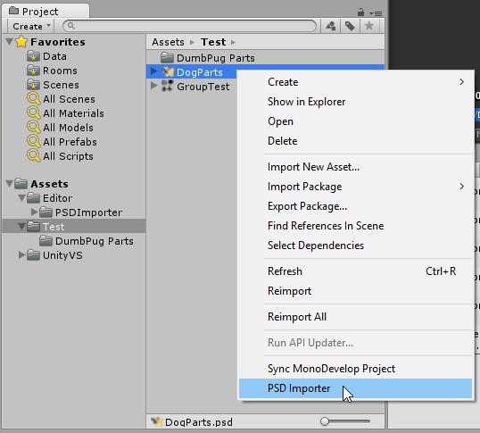
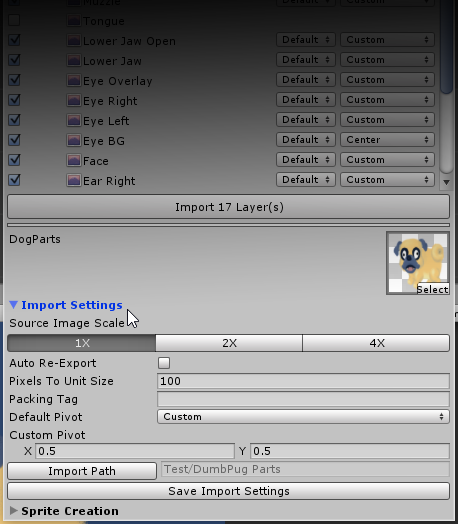
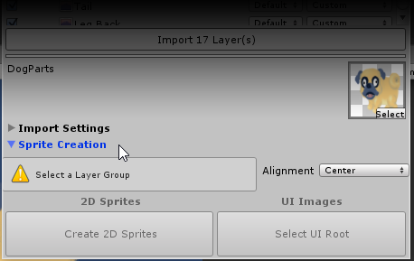

# Unity Psd Importer #

Unity PSD Importer allows Unity to import individual layers from a PSD, as well as reconstruct Photoshop Layer Groups inside Unity to simplify workflows.

[Demo Video](https://www.youtube.com/watch?v=9rSxRf2SNeU)

[Tutorial Video](https://www.youtube.com/watch?v=d7d52Vizc0U)

## Installation ##

Install the importer by placing the [compiled DLL](/bin/PhotoShopImporter.dll) either in an existing `Editor` directory of your Unity project or creating a new `Editor` directory.

## Usage ##

To use the importer, right click on a PSD in the Project Explorer and select `PSD Importer`.

### Layers Settings ###

The layers display reflects the state of the PSD file as it was saved. Visible layers are imported when the Import Layers button is pressed.

When a layer will be imported, additional settings will appear beside the layer.

The **size drop down** reduces the image size of an imported layer, while retaining the same display size in relation to the other layers. This can be useful for resizing less important images as an optimization.

The **layer pivot drop** down lets you set the pivot point of the layer when imported to Unity.

### Import Settings ###

These are global settings that are applied to the layers when importing from the PSD.

**Source Image Scale**

The source PSD might be scaled larger than the target size for the images in Unity. This setting allows you to scale down the imported layers.

The *1X, 2X, 4X* setting indicates how the layers are scaled during import.

- 1X means no reduction, 100%
- 2X will scale down to 50%
- 4X will scale it down to 25%.

**Auto Re-Import**

If this is checked, whenever Unity detects that a PSD is modified, the visible layers will automatically be re-imported.

**Pixels to unit size**

The Pixels Per Unit applied by default to the imported layers.

**Packing Tag**

The tag to apply for Unity's atlas packing system.

**Default Pivot**

The pivot point applied by default to imported layers, unless specified

**Import Path**

If import path is empty, the imported layers are placed in the same directory as the PSD file. If not, you can set a directory for the imported layers to go to.

### Sprite Creation ###

Sprite creation recreates the layouts of layer groups in the PSD document inside Unity. It can create either 2D Sprite objects or Unity UI Image objects.

First, select a `Layer Group` in the layers portion of the importer. Selecting a Layer Group will also select PSD Layers and Layer Groups that are contained by it.

*Alignment* determines where the root object of the layer group will be aligned, relative to the layer group layout.

If an object is selected in the `Scene Hierarchy`, the layer group will be recreated on the selected object. If no object is selected, the layer group will be created without a parent in the Scene Hierarchy.

To create `UI Images` for use with Unity UI, first select an object that is part of a UI hierarchy. When a valid object is selected, the `Create UI Images` button can be clicked.

## Known Limitations ##

The PSD importer might not be able to handle PSD files generated by software aside from Photoshop.

Layers with the same name will conflict and only one will be imported.

## Contributing ##

This repository contains the release DLL and the Visual Studio project used to compile the importer into a DLL.

The main importer code resides in the [UnityPsdImporterModule repository](https://github.com/ChemiKhazi/UnityPsdImporterModule). It is recommended to use that repository as a git submodule in a Unity project for working on the PSD importer.

### Unity Editor Compilation ###

To compile the Unity PSD Importer in the Unity3D Editor put the files `gmcs.rsp` and `smcs.rsp` found in this repository in the root `Assets` directory of your project.

These files will allow Unity to compile the PSD importer code in the editor.

## Acknowledgements ##

[@BanBury](https://github.com/Banbury) for the [PSD Importer](https://github.com/Banbury/UnityPsdImporter) that this project was forked from

The [PSD Filetype plugin](http://psdplugin.codeplex.com/) that makes reading PSD files inside Unity possible
